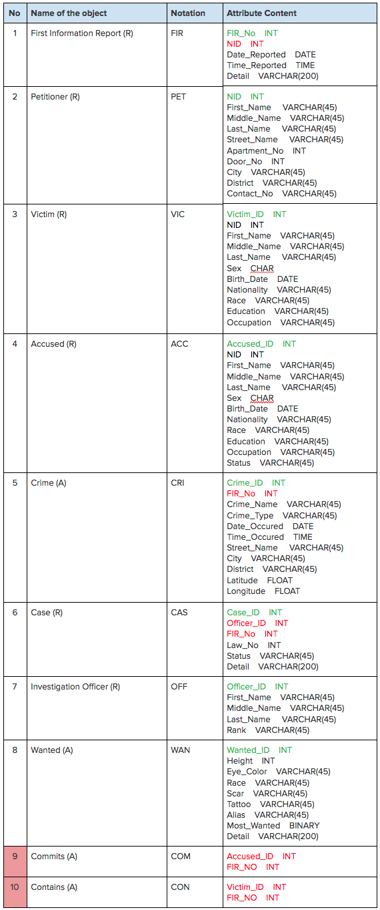
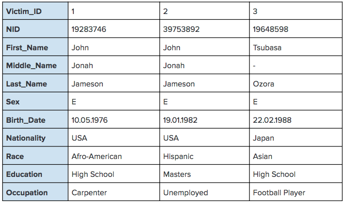

# **Criminal Record Management System**
Relational Database Model of Criminal Record Management System

Last Change: June 2018
Author: Atacan Demiralp

# ABSTRACT

Crime is one of the most significant problems, keeping evolving, all around the world. Crime can be controlled by understanding the reason behind it. In order to do that, crime should be well-recorded, analyzed, and ended up with effective solutions in terms of the analysis output. In this study, a relational database design for criminal record management system is presented in order to store crime information to be analyzed.

# INTRODUCTION

Criminal Record Management System is a web software which provides service for reporting crimes, cases, criminals, and related details to help the national security units, such as Police. It is designed to
1. Provide a crime management tool easily accessible by everybody online
2. Support crime analysis
3. Save time and man-power by entering information online
4. Minimize paperwork
5. Ensure data accuracy
6. Provide security and backup

Police can add information into the system when there exists a First Information Report for a crime. Police start investigation after they write the report. As they learn and gather more information about the crime, they can add more into the system. It can be used for storing both past crimes with loads of information or new crimes with less information. So, it also provides flexibility. 

The software works as client-server model. User (client) who has privilege to access the server, can view the information already stored, add new information, and update the information according to the privilege level. The server side contains the database which is the all information about crime. This study covers how to model the relational database to be communicated with the software. The client-side implementation, UI design, and  server-side implementation are not covered. The overall aim is to prototype the relational database system.

# IT SYSTEM OVERVIEW

## Client-Server Model


## User Interface

- A login page to access to the server
- A search page which allows searches by FIR no, case no, and criminal name
- Enter, modify, and view options for users
- One quick report button to report everything about a case
- Responsive interface design

## Hardware

Computers, smartphones, tablets

## Software

- Any browser, also ported as mobile apps for IOS and Android
- SQL Server 2017 for database

# ENTITIES & ATTRIBUTES

## Entities

- **Case:** The issue to be investigated by the police, and resolved by the court
- **Crime:** The offense to be punished by law
- **Victim:**    The person harmed, injured, or killed as a result of a crime
- **Accused:** The person who is charged with crime
- **Wanted:** The accused, wanted by police
- **Petitioner:** The person who complaints under the jurisdiction of police
- **FIR:** First Information Report, written by the police after they gather information from the petitioner about the criminal case
- **Investigation Officer:** The police officer who makes investigation on the case

## Attributes

### Case
- **Case ID:** Each case has a unique case ID
- **Crime ID:** Which crime is about (as foreign key)
- **Law Number:** To learn more about the case from the public law records system
- **Status:** To see if a case is open or closed
- **Detail:** The detail to be written
- **Investigation Officer:** The ID of the officer who makes investigation

### Crime

- **Crime ID:** Unique crime ID for each occurence
- **FIR No:** Which FIR is about (as foreign key)
- **Crime Name:** The classified name of  crime
- **Crime Type:** The classified type of crime
- **Time Occurred:** What time crime has occurred
- **Date Occurred:** When crime has occured
- **District:** State or district name where crime has occured
- **City:** City name where crime has occured
- **Street Name:** Street name where crime has occured
- **Latitude:** North-south geographic coordinate of crime
- **Longitude:** East-west geographic coordinate of crime

### Victim

- **Victim ID:** Number for each victim to be identified uniquely.
- **FIR No:** FIR number of the report which is about victim (as foreign key)
- **NID:** National identity number of victim
- **First Name:** First name of a victim
- **Middle Name:** Middle name of  victim
- **Last Name:** Last name of  victim
- **Sex:** Gender of victim
- **Birth Date:** Date of birth information of victim
- **Nationality:** Nationality of victim
- **Race:** Race of victim
- **Education:** Education level of victim
- **Occupation:** Profession of victim

### Accused

- **Accused ID:** Unique number for each accused
- **FIR No:** FIR number of the report which is about accused (as foreign key)
- **NID:** National identity number of accused
- **First Name:** First name of accused
- **Middle Name:** Middle name of  accused
- **Last Name:** Last name of  accused
- **Sex:** Gender of accused
- **Birth Date:** Date of birth information of accused
- **Nationality:** Nationality of accused
- **Race:** Race of accused
- **Occupation:** Profession of accused
- **Education:** Education level of accused
- **Status:** The status of accused (wanted, under custody, arrested, escaped, bailed, released)

### Wanted

- **Wanted ID:** Unique number for wanted in the list
- **Alias:** Nickname of wanted
- **Height:** Height of wanted
- **Race:** Racial information of wanted
- **Eye Color:** Eye color of wanted
- **Scar:** Any scar visible on the body of wanted
- **Tattoo:** Any tattoo visible on the body of wanted
- **Most Wanted:** If the wanted is in the most wanted list
- **Detail:** Any other details about wanted

### Petitioner

Anybody who know about the crime, saw the offence, and wants to report it to the police can be petitioner. It does not have to be victim itself.

- **NID:** National identity number of petitioner
- **First Name:** First name of petitioner
- **Middle Name:** Second name of  petitioner
- **Last Name:** Last name of  petitioner
- **Street Name:** Street name of address of petitioner
- **Apartment No:** Apartment number of address of petitioner
- **Door No:** Door number of address of petitioner
- **City:** City in where petitioner lives
- **District:** District in where petitioner lives
- **Contact No:** Mobile contact number of petitioner

### FIR

- **FIR No:** Unique ID for each FIR
- **Petitioner NID:** National ID number of the petitioner
- **Date Reported:** When the FIR has written
- **Time Reported:** What time the FIR has written
- **Detail:** Incident details

### Investigation Officer:

- **Officer ID:** Unique ID number of the officer
- **First Name:** First name of the officer
- **Second Name:** Second name of the officer
- **Last Name:** Last name of the officer
- **Rank:** Rank of the officer

# RELATIONSHIPS BETWEEN ENTITIES

### FIR - Petitioner

- FIR is filed by petitioner.
- One FIR has to be filed by one and only one petitioner. Unknown petitioner is not acceptable to file the report. So, one petitioner is necessary for an FIR.
- One FIR is necessary to record crime and start investigation.
- One petitioner can file  more than one FIRs.

There is **mandatory one to mandatory many** relationship between FIR and petitioner.

### FIR - Victim

- FIR is filed for  suffered victim.
- There can be one or many victims for one FIR. One victim is necessary for an FIR.
- A victim can be suffered from multiple incidents of different FIRs.
- A victim has to have a necessary FIR.

There is **mandatory many to mandatory many** relationship between FIR and victim.

### FIR - Accused

- FIR is filed against accused.
- One FIR can point more than one accused.
- More than one FIRs can point one accused, and one accused is always pointed by at least one FIR.

There is **mandatory many to mandatory many** relationship between FIR and accused.

### FIR - Crime

- FIR is filed because of an incident or crime.
- One FIR can include necessarily at least one crime.
- One crime can be pointed by one and only one FIR.

There is **mandatory one to mandatory many** relationship between FIR and crime.

### FIR - Case

- After FIR is written, case begins to be investigated.
- Police decides whether and incident is investigated. An incident might be not serious enough to be investigated. The complaint might not be against law.
- If an incident worths to be investigated, then police opens investigation case.

There is **mandatory one to optional one** relationship between FIR and case.

### Case - Investigation Officer

- One case is investigated by one and only one investigation officer.
- An investigation officer can make investigation on more than one cases.
- An investigation officer has to make at least one investigation.

There is **mandatory one to mandatory many** relationship between case and investigation officer.

### Accused - Wanted

- Wanted is always an accused.
- An accused may not be wanted.

There is **mandatory one to optional one** relationship between accused and wanted.

# SET OF ENTITY OBJECTS

Primary Key= Green, Foreign Key= Red, Real objects (R) , abstract objects (A)



# IDENTIFICATION TYPES OF REAL RELATIONSHIPS BETWEEN ENTITY OBJECTS

Table 1: The matrix of real relationships before eliminating the relation M:M


Table 2: The matrix of real relationships after eliminating the relation M:M


# CONCEPTUAL DATA MODEL


# PHYSICAL DATA MODEL (EER DIAGRAM)


# FUNCTIONAL DEPENDENCIES

- Table Name: FIR


FIR_No ⟶ {NID, Date_Reported, Time_Reported, Detail}

Normal Form: 3NF


- Table Name: Petitioner


NID ⟶ {First_Name, Middle_Name, Last_Name, Street_Name, Apartment_No, Door_No, City, District, Contact_No}

Normal Form: 3NF


- Table Name: Victim



Victim_ID is not same as the NID. One person can be victim in several times and cannot take the same Victim_ID twice or more. Victim_ID is generated while a FIR is reported.

Victim_ID ⟶ {NID, First_Name, Middle_Name, Last_Name, Sex, Birth_Date, Nationality, Race, Education, Occupation}

Normal Form: 3NF


- Table Name: Accused


Accused_ID is not same as the NID. One person can be accused in several times and cannot take the same Accued_ID twice or more. Accused_ID is generated while a FIR is reported.

Accused_ID ⟶ {NID, First_Name, Middle_Name, Last_Name, Sex, Birth_Date, Nationality, Race, Education, Occupation, Status}

Normal Form: 3NF


- Table Name: Crime


Crime_ID ⟶ {FIR_No, Crime_Name, Crime_Type, Date_Occured, Time_Occured, Street_Name, City, District, Latitude, Longitude}

Normal Form: 3NF


- Table Name: Case


Case_ID ⟶ {Officer_ID, FIR_No, Law_No, Status, Detail}

{Officer_ID, Law_No} ⟶ {Case_ID, FIR_No, Status, Detail}

Normal Form: 3NF


- Table Name: Officer


Officer_ID ⟶ {First_Name, Middle_Name, Last_Name, Rank}

Normal Form: 3NF


- Table Name: Wanted


Wanted_ID ⟶ {Accused_ID, Height, Eye_Color, Race, Scar, Tattoo, Alias, Most_Wanted, Detail}

Accused_ID ⟶ Wanted_ID

Normal Form: BCNF

## Intermediary Tables

- Table Name: Contains
- Intermediary table between to solve M:M relation between FIR - Victim.


Compound Key: {FIR_No, Victim_No}

{FIR_No, Victim_No} ⟶ {FIR_No, Victim_No}

Normal Form: 3NF


- Table Name: Commits
- Intermediary table between to solve M:M relation between FIR - Accused.


Compound Key: {FIR_No, Accused_ID}

{FIR_No, Accused_ID} ⟶ {FIR_No, Accused_ID}

Normal Form: 3NF


## About “Detail” Columns

Although the “Detail” columns do not contain a single value and technically violate the normal forms, it is important to store data as comments in this specific domain area. It is assumed that the Detail columns are atomic and exist only to give additional information. The columns can be removed in order to get rid off normalization violation, however it is not realistic. Police need information also as comment which are single value as a whole information.


# DATA DEFINITION LANGUAGE (DDL)

DDL consists of the statements used to Create, Alter, and Drop database objects.

- Create Database:
```SQL
CREATE DATABASE CrimeRecords;
```

- Drop Database:
```SQL
DROP DATABASE CrimeRecords;
```

- Create Table:
```SQL
CREATE TABLE FIR(
	FIR_NO INT,
	Date_Reported DATE
	Time_Reported TIME
	Detail VARCHAR(200));

```

- Alter Table:
```SQL
ALTER TABLE Petitioner(
	DROP District VARCHAR(45),
	ADD State VARCHAR(45));
```

- Drop Table:
```SQL
DROP TABLE Petitioner;
```

- Truncate Table:
```SQL
TRUNCATE TABLE FIR;
```
(TRUNCATE TABLE statement removes all rows from a table.)

# DATA MODIFICATION LANGUAGE (DML)

DML consists of the statements used to Retrieve, Insert, Update, and Remove data within DB objects.

- Retrieve
```SQL
SELECT First_Name, Last_Name, Contact_No
FROM Petitioner
```

- Insert
```SQL
INSERT INTO Case (FIR_No, Law_No, Status, Officer_ID)
VALUES (111847, 1746345, ‘Open’, 1010)
```

- Update
```SQL
UPDATE Victim 
SET Sex=‘E’, Birt_Date= ‘12-09-1987’, Race= ‘Asian’, NID= 110680282
WHERE Victim_ID= 20024
```

- Delete
```SQL
DELETE FROM Accused
WHERE NID= 10020045 
```

# TYPICAL QUERIES

- Print the full names and wanted IDs of the most wanteds.
```SQL
SELECT A.First_Name, A.Middle_Name, A.Last_Name, W.Wanted_ID
FROM Wanted W
JOIN Accused A ON A.Accused_ID = W.Accused_ID
WHERE W.Most_Wanted = 1
```

- Print the national identity numbers and number of filed FIRs of petitioners who have filed more than 1 FIR in 2015.
```SQL
SELECT P.NID, Count (F.FIR_No)
FROM Petitioner P
JOIN FIR F ON F.NID = P.NID
WHERE YEAR(F.Date_Reported) = 2015
GROUP BY P.NID
HAVING Count (F.FIR_No) > 1
```

- Print all the property crimes investigated by officer Carey Mahoney.
```SQL
SELECT *
FROM Crime C
JOIN FIR F ON F.FIR_No = C.FIR_No
JOIN Case CA ON CA.FIR_No = F.FIR_No
JOIN Officer OF ON OF.Officer_ID = CA.Officer_ID
WHERE C.Crime_Type = “Property Crime” AND OF.First_Name = “Carey” AND OF.Last_Name = ‘Mahoney’
```

- Print the education information of accused ones who have been arrested for burglary.
```SQL
SELECT A.Education
FROM Accused A
JOIN Commits Co ON Co.Accused_ID = A.Accused_ID
JOIN FIR F ON F.FIR_No = Co.FIR_No
JOIN Crime CR ON CR.FIR_No = F.FIR_No
WHERE CR.Crime_Name = “Burglary” AND A.Status = “Arrested”
```

- Print the number of crimes, grouped by crime type since 2015.
```SQL
SELECT CR.Crime_Type, Count(CR.Crime_ID)
FROM Crime CR
WHERE CR.Date_Occured > ‘01.01.2015’
GROUP BY CR.Crime_Type
```

- Print the top 10 accused who have committed more crimes than last year.
```SQL
WITH Table2018 AS (
SELECT TOP 10 A.Accused_ID, A.First_Name, A.Middle_Name, A.Last_Name, COUNT(CR.Crime_ID) AS CrimeNum2018
FROM Accused A
JOIN Commits Co ON Co.Accused_ID = A.Accused_ID
JOIN FIR F ON F.FIR_No = Co.FIR_No
JOIN Crime CR ON CR.FIR_No = F.FIR_No
WHERE YEAR(CR.Date_Occured) = 2018
GROUP BY A.Accused_ID, A.First_Name, A.Middle_Name, A.Last_Name
ORDER BY CrimeNum2018 DESC),
Table2017 AS (
SELECT TOP 10 A.Accused_ID, A.First_Name, A.Middle_Name, A.Last_Name, COUNT(CR.Crime_ID) AS CrimeNum2017
FROM Accused A
JOIN Commits Co ON Co.Accused_ID = A.Accused_ID
JOIN FIR F ON F.FIR_No = Co.FIR_No
JOIN Crime CR ON CR.FIR_No = F.FIR_No
WHERE YEAR(CR.Date_Occured) = 2017
GROUP BY A.Accused_ID, A.First_Name, A.Middle_Name, A.Last_Name)
SELECT *
FROM Table2018
WHERE CrimeNum2018 > (SELECT COUNT(CrimeNum2017) FROM Table2017)
```

# SIZE OF THE DATABASE

INT:  4 Bytes,		DATE:	3 Bytes,		TIME:	4 Bytes,		VARCHAR(n):	n Bytes

Table Petitioner:  327 Bytes,

Table FIR:  208 Bytes,

Table Victim:  327 Bytes,

Table Accused:  372 Bytes,

Table Wanted:  434 Bytes,

Table Crime:  244 Bytes,

Table Case:  253 Bytes,

Table Officer:   184 Bytes

In a district with average 800.000 population, the expected crime number is 5000 to 10.000 in a year. Each crime has minimum 1 FIR, 1 Accused, 1 Victim, 1 Petitioner, 1 Case, and 1 Officer.

1 crime =~ 6 tables =~ 57 columns

1 crime =~ 1915 Bytes

100 crime =~ 1 wanted =~ 9 columns =~ 191934 Bytes =~ 187 KB

5000 crime x index factor x overhead factor = 187 x 50 x 2 x 1.2 = 22440 KB =~ 21 MB

10000 crime x index factor x overhead factor = 187 x 100 x 2 x 1.2 = 22440 KB =~ 42 MB

Additional approximate records for 1:M relations =~ 10 - 20 MB

Total =~ 30 MB - 60 MB

In a country with average 10 Millions population, the expected crime number is 50.000 to 100.000 in a year.

Total =~ 300 MB - 600 MB

**In 3 years, the expected database size for a country with average 10 Millions population is 900 MB - 1.8 GB.**

# CONCLUSION

The relational model is a good choice for the domain, easy to implement and understand. The database holds huge amount of data. It is normalized by transforming M:M relations into 1:M and adding additional data objects. Data is meaningful and can be analyzed as more records are added and the database grows. It can show us,
- How many crimes in total in a city, district or the whole country,
- What the general profile of the criminals is in terms of age, occupation, and education,
- What should be considered first in order to prevent crimes from happening,
- What the major crime types and names are,
- How many FIRs in average are reported in a month,
- How many crimes in average are committed by one accused,
- How the growth of number of crimes month by month and year by year,
- Whether the solutions to decrease the number of crimes are effective according to the analysis.

