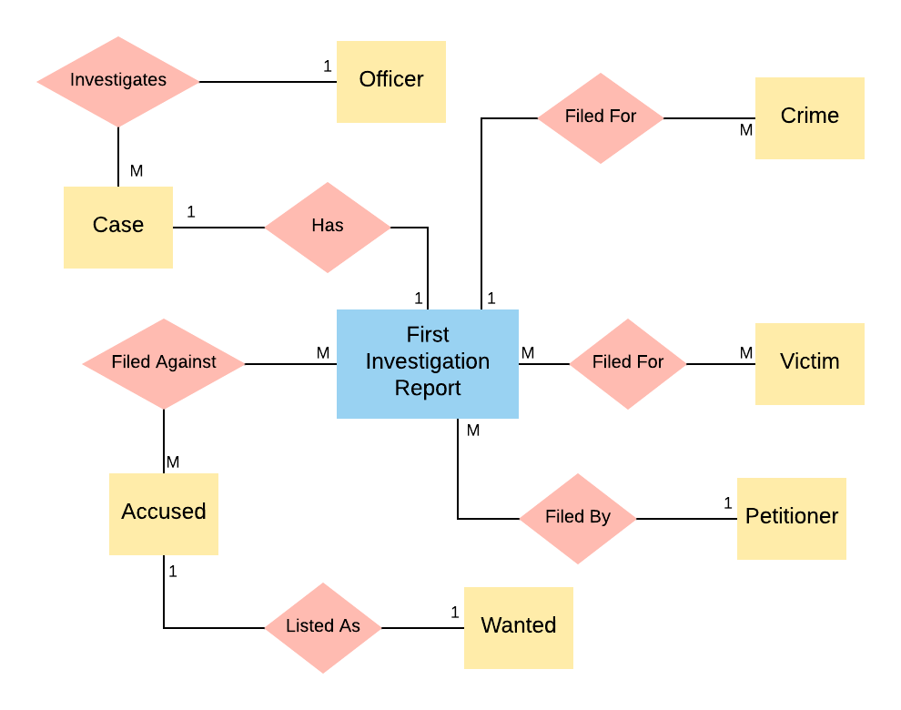
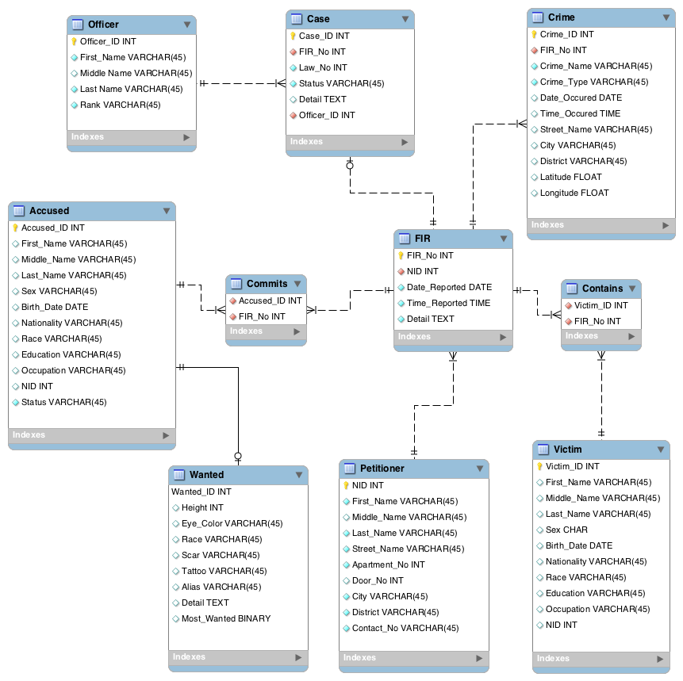

# **Criminal Record Management System**
Relational Database Model of Criminal Record Management System

May 2018
Author: Atacan Demiralp

# ABSTRACT

Crime is one of the most significant problems, keeping evolving, all around the world. Crime can be controlled by understanding the reason behind it. In order to do that, crime should be well-recorded, analyzed, and ended up with effective solutions in terms of the analysis output. In this study, a relational database design for criminal record management system is presented in order to store crime information to be analyzed.

# INTRODUCTION

Criminal Record Management System is a web software which provides service for reporting crimes, cases, criminals, and related details to help the national security units, such as Police. It is designed to
1. Provide a crime management tool easily accessible by everybody online
2. Support crime analysis
3. Save time and man-power by entering information online
4. Minimize paperwork
5. Ensure data accuracy
6. Provide security and backup

Police can add information into the system when there exists a First Information Report for a crime. Police start investigation after they write the report. As they learn and gather more information about the crime, they can add more into the system. It can be used for storing both past crimes with loads of information or new crimes with less information. So, it also provides flexibility. 

The software works as client-server model. User (client) who has privilege to access the server, can view the information already stored, add new information, and update the information according to the privilege level. The server side contains the database which is the all information about crime. This study covers how to model the relational database to be communicated with the software. The client-side implementation, UI design, and  server-side implementation are not covered. The overall aim is to prototype the relational database system.

# IT SYSTEM OVERVIEW

## Client-Server Model

## User Interface

- A login page to access to the server
- A search page which allows searches by FIR no, case no, and criminal name
- Enter, modify, and view options for users
- One quick report button to report everything about a case
- Responsive interface design

## Hardware

Computers, smartphones, tablets

## Software

- Any browser, also ported as mobile apps for IOS and Android
- SQL Server 2017 for database

# ENTITIES & ATTRIBUTES

## Entities

- **Case:** The issue to be investigated by the police, and resolved by the court
- **Crime:** The offense to be punished by law
- **Victim:**    The person harmed, injured, or killed as a result of a crime
- **Accused:** The person who is charged with crime
- **Wanted:** The accused, wanted by police
- **Petitioner:** The person who complaints under the jurisdiction of police
- **FIR:** First Information Report, written by the police after they gather information from the petitioner about the criminal case
- **Investigation Officer:** The police officer who makes investigation on the case

## Attributes

### Case
- **Case ID:** Each case has a unique case ID
- **Crime ID:** Which crime is about (as foreign key)
- **Law Number:** To learn more about the case from the public law records system
- **Status:** To see if a case is open or closed
- **Detail:** The detail to be written
- **Investigation Officer:** The ID of the officer who makes investigation

### Crime

- **Crime ID:** Unique crime ID for each occurence
- **FIR No:** Which FIR is about (as foreign key)
- **Crime Name:** The classified name of  crime
- **Crime Type:** The classified type of crime
- **Time Occurred:** What time crime has occurred
- **Date Occurred:** When crime has occured
- **District:** State or district name where crime has occured
- **City:** City name where crime has occured
- **Street Name:** Street name where crime has occured
- **Latitude:** North-south geographic coordinate of crime
- **Longitude:** East-west geographic coordinate of crime

### Victim

- **Victim ID:** Number for each victim to be identified uniquely.
- **FIR No:** FIR number of the report which is about victim (as foreign key)
- **NID:** National identity number of victim
- **First Name:** First name of a victim
- **Middle Name:** Middle name of  victim
- **Last Name:** Last name of  victim
- **Sex:** Gender of victim
- **Birth Date:** Date of birth information of victim
- **Nationality:** Nationality of victim
- **Race:** Race of victim
- **Education:** Education level of victim
- **Occupation:** Profession of victim

### Accused

- **Accused ID:** Unique number for each accused
- **FIR No:** FIR number of the report which is about accused (as foreign key)
- **NID:** National identity number of accused
- **First Name:** First name of accused
- **Middle Name:** Middle name of  accused
- **Last Name:** Last name of  accused
- **Sex:** Gender of accused
- **Birth Date:** Date of birth information of accused
- **Nationality:** Nationality of accused
- **Race:** Race of accused
- **Occupation:** Profession of accused
- **Education:** Education level of accused
- **Status:** The status of accused (wanted, under custody, arrested, escaped, bailed, released)

### Wanted

- **Wanted ID:** Unique number for wanted in the list
- **Accused ID:** What accused ID held by wanted (as foreign key)
- **Alias:** Nickname of wanted
- **Height:** Height of wanted
- **Race:** Racial information of wanted
- **Eye Color:** Eye color of wanted
- **Scar:** Any scar visible on the body of wanted
- **Tattoo:** Any tattoo visible on the body of wanted
- **Most Wanted:** If the wanted is in the most wanted list
- **Detail:** Any other details about wanted

### Petitioner

Anybody who know about the crime, saw the offence, and wants to report it to the police can be petitioner. It does not have to be victim itself.

- **NID:** National identity number of petitioner
- **First Name:** First name of petitioner
- **Middle Name:** Second name of  petitioner
- **Last Name:** Last name of  petitioner
- **Street Name:** Street name of address of petitioner
- **Apartment No:** Apartment number of address of petitioner
- **Door No:** Door number of address of petitioner
- **City:** City in where petitioner lives
- **District:** District in where petitioner lives
- **Contact No:** Mobile contact number of petitioner

### FIR

- **FIR No:** Unique ID for each FIR
- **Petitioner NID:** National ID number of the petitioner
- **Date Reported:** When the FIR has written
- **Time Reported:** What time the FIR has written
- **Detail:** Incident details

### Investigation Officer:

- **Officer ID:** Unique ID number of the officer
- **First Name:** First name of the officer
- **Second Name:** Second name of the officer
- **Last Name:** Last name of the officer
- **Rank:** Rank of the officer

# RELATIONSHIPS BETWEEN ENTITIES

### FIR - Petitioner

- FIR is filed by petitioner.
- One FIR has to be filed by one and only one petitioner. Unknown petitioner is not acceptable to file the report. So, one petitioner is necessary for an FIR.
- One FIR is necessary to record crime and start investigation.
- One petitioner can file  more than one FIRs.

There is **mandatory one to mandatory many** relationship between FIR and petitioner.

### FIR - Victim

- FIR is filed for  suffered victim.
- There can be one or many victims for one FIR. One victim is necessary for an FIR.
- A victim can be suffered from multiple incidents of different FIRs.
- A victim has to have a necessary FIR.

There is **mandatory many to mandatory many** relationship between FIR and victim.

### FIR - Accused

- FIR is filed against accused.
- One FIR can point more than one accused. However, an accused can be unknown.
- More than one FIRs can point one accused, and one accused is always pointed by at least one FIR.

There is **mandatory many to optional many** relationship between FIR and accused.

### FIR - Crime

- FIR is filed because of an incident or crime.
- One FIR can include necessarily at least one crime.
- One crime can be pointed by one and only one FIR.

There is **mandatory one to mandatory many** relationship between FIR and crime.

### FIR - Case

- After FIR is written, case begins to be investigated.
- Police decides whether and incident is investigated. An incident might be not serious enough to be investigated. The complaint might not be against law.
- If an incident worths to be investigated, then police opens investigation case.

There is **mandatory one to optional one** relationship between FIR and case.

### Case - Investigation Officer

- One case is investigated by one and only one investigation officer.
- An investigation officer can make investigation on more than one cases.
- An investigation officer has to make at least one investigation.

There is **mandatory one to mandatory many** relationship between case and investigation officer.

### Accused - Wanted

- Wanted is always an accused.
- An accused may not be wanted.

There is **mandatory one to optional one** relationship between accused and wanted.

# SET OF ENTITY OBJECTS

Primary Key= Green, Foreign Key= Red, Real objects (R) , abstract objects (A)

# IDENTIFICATION TYPES OF REAL RELATIONSHIPS BETWEEN ENTITY OBJECTS

Table 1: The matrix of real relationships before eliminating the relation M:M

Table 2: The matrix of real relationships after eliminating the relation M:M

# CONCEPTUAL DATA MODEL

# PHYSICAL DATA MODEL (EER DIAGRAM)

